How to use package PINTAS
=============================================================


```r
library(PINTAS)
```

```
## Loading required package: igraph
## Loading required package: data.table
## Loading required package: plot3D
## Loading required package: clue
## Loading required package: plyr
## Loading required package: Matrix
## Loading required package: parallel
## Loading required package: lpSolveAPI
```


First we have to build the networks. We can build them using the function *read.network*. For example, from a list of protein interactions.

```r
edges1 = matrix(c(
  "85962.HP0109", "85962.HP0136",
"85962.HP0109", "85962.HP0137",
"85962.HP0136", "85962.HP0247",
"85962.HP0136", "85962.HP0303",
"85962.HP0137", "85962.HP0247",
"85962.HP0137", "85962.HP0853",
"85962.HP0247", "85962.HP1316"
), ncol=2, byrow=TRUE)
hpy <- read.network(edges1, mode="edges")

plot(hpy)
```

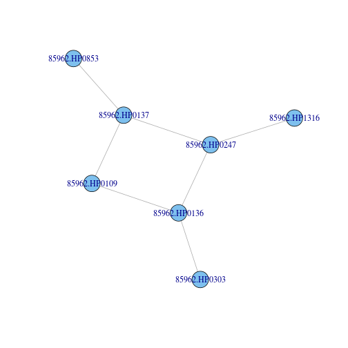 


```r
edges2= matrix(c(
"DBP2_YEAST", "RL2A_YEAST",
"HAS1_YEAST", "MAK5_YEAST",
"NOP10_YEAST", "DBP2_YEAST",
"NOP10_YEAST", "HAS1_YEAST",
"NOP10_YEAST", "MAK5_YEAST",
"NOP10_YEAST", "RL2A_YEAST",
"TSA1_YEAST", "HSP7F_YEAST",
"TSA1_YEAST", "TSA2_YEAST"
), ncol=2, byrow=TRUE)
sce <- read.network(edges2,mode="edges")
plot(sce)
```

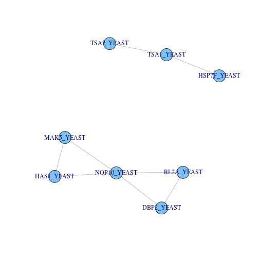 


Now we need a similarity matrix, you can use the function *read.matrix* if you want to read the matrix from a file, or 
you can compute it using the function *compute.matrix*. In 
this case we load the data *Sim1* and *Sim2*, which are included in the package, and compute a distance similarity matrix, with 
the function *compute.matrix*.

```r
data(Sim1)
data(Sim2)
Dis1 = compute.matrix(net1=hpy)
Dis2 = compute.matrix(net1=sce)

Sim1 = (Sim1+Dis1)/2
Sim2 = (Sim2+Dis2)/2
```


When we have the networks and the similarity matrices, we can compute the clusters with the functions *cluster.network* and *extract.clusters*, and then visualize the clusters with *display.clusters*.


```r
clust1 = cluster.network(sigma=Sim1,lambda=0.2,k=5)

clusters1 = extract.clusters(Net=hpy,ClustMat=clust1)
names(clusters1)=colnames(Sim1)
print(names(clusters1))
```

```
## [1] "85962.HP0109" "85962.HP0136" "85962.HP0137" "85962.HP0247"
## [5] "85962.HP0303" "85962.HP0853" "85962.HP1316"
```

```r
for(i in 1:length(clusters1)){
  print(names(clusters1)[i])
  plot(clusters1[[i]])
}
```

```
## [1] "85962.HP0109"
```

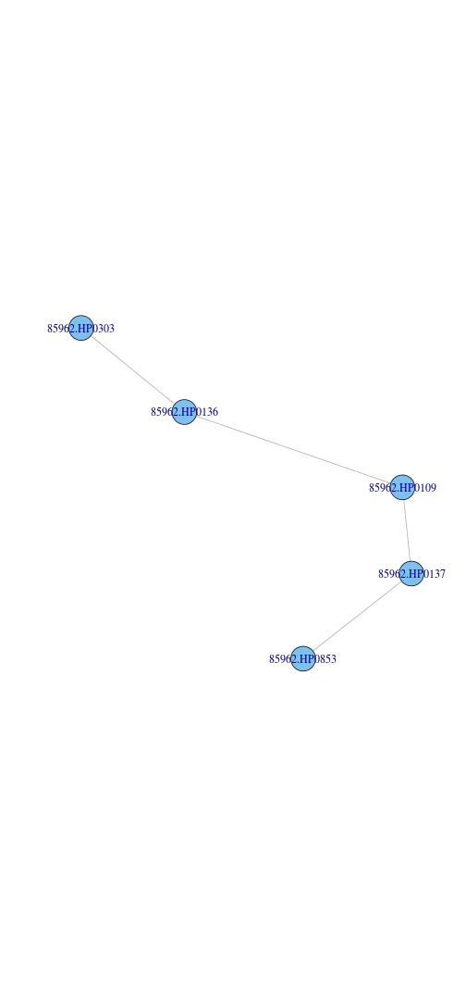 

```
## [1] "85962.HP0136"
```

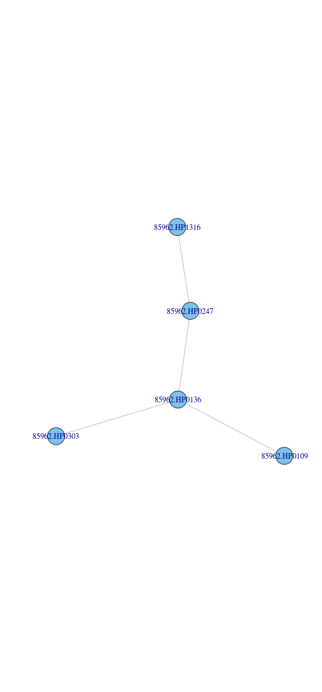 

```
## [1] "85962.HP0137"
```

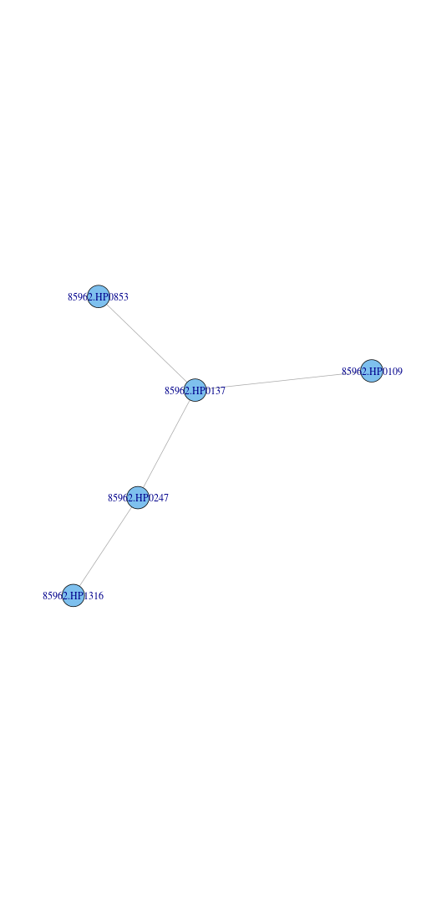 

```
## [1] "85962.HP0247"
```

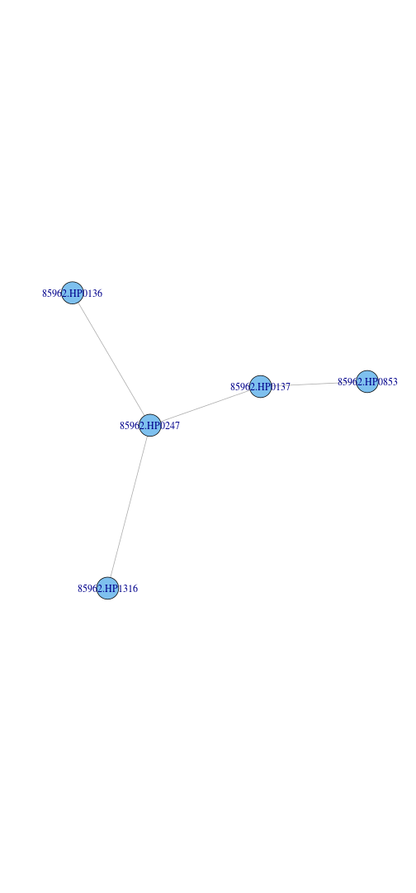 

```
## [1] "85962.HP0303"
```

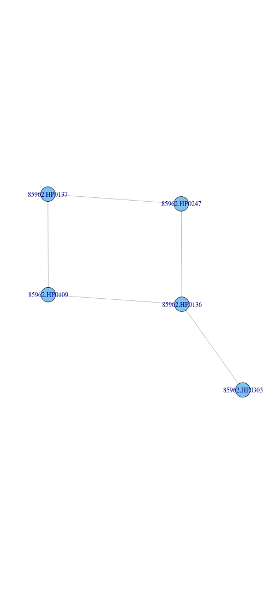 

```
## [1] "85962.HP0853"
```

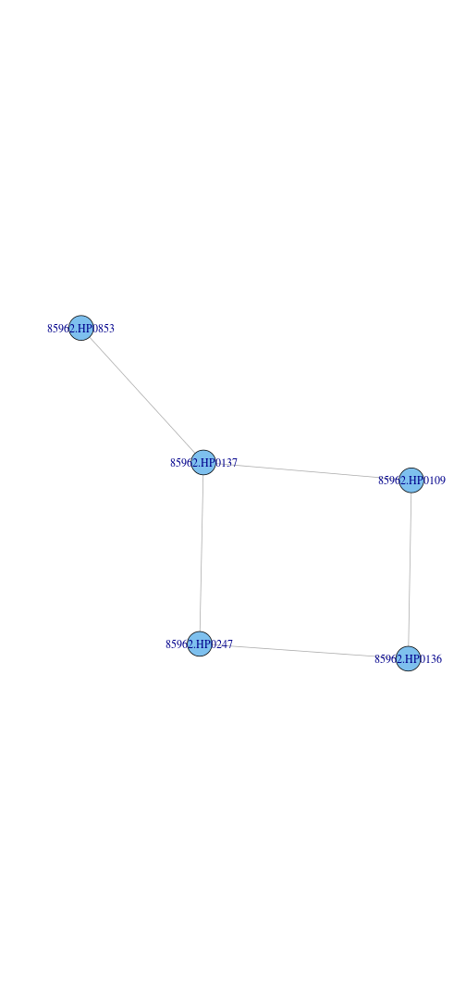 

```
## [1] "85962.HP1316"
```

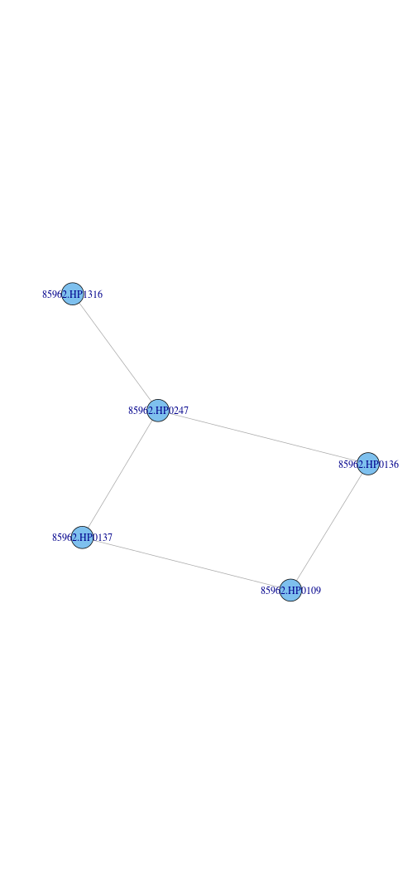 


```r
par(oma=c(3,3,4,3))
display.clusters(clust=clust1,Net=hpy,main="")
cols=c("yellow","black","red","green")
 legend(x=0,y=1.25,legend=0:3,fill=cols,horiz=TRUE,bty="n",xpd=TRUE,cex=3)
```


```r
clust2 = cluster.network(sigma=Sim2,lambda=0.2,k=5)

clusters2 = extract.clusters(Net=sce,ClustMat=clust2)
names(clusters2)=colnames(Sim2)
 

for(i in 1:length(clusters2)){
  print(names(clusters2)[i])
  plot(clusters2[[i]])
}
```

```
## [1] "DBP2_YEAST"
```

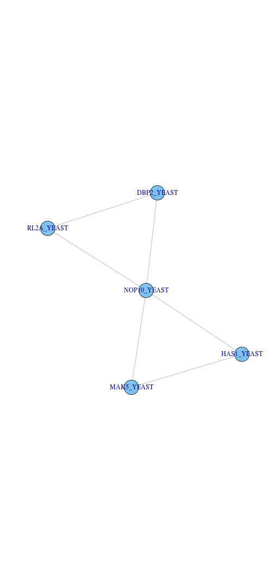 

```
## [1] "HAS1_YEAST"
```

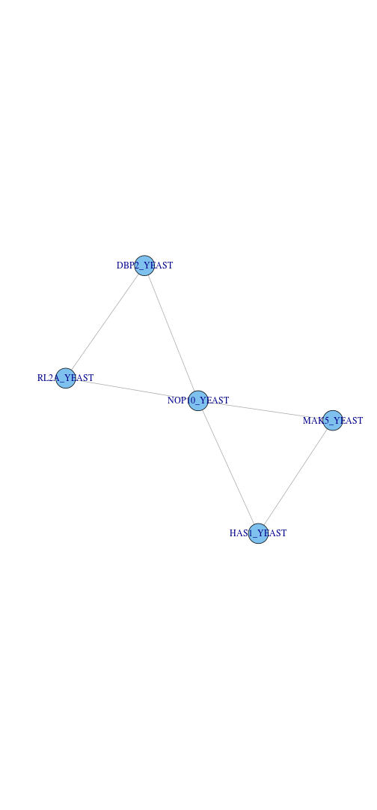 

```
## [1] "NOP10_YEAST"
```

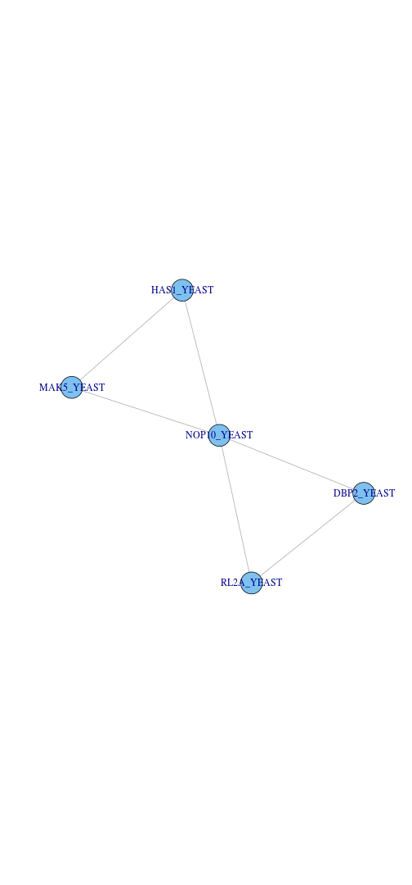 

```
## [1] "TSA1_YEAST"
```

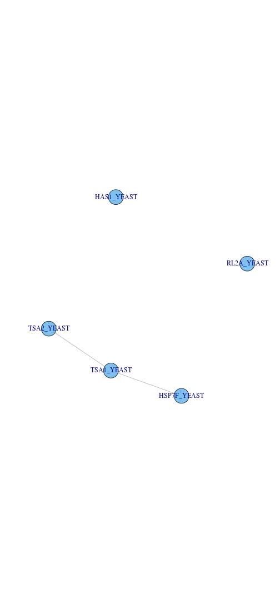 

```
## [1] "RL2A_YEAST"
```

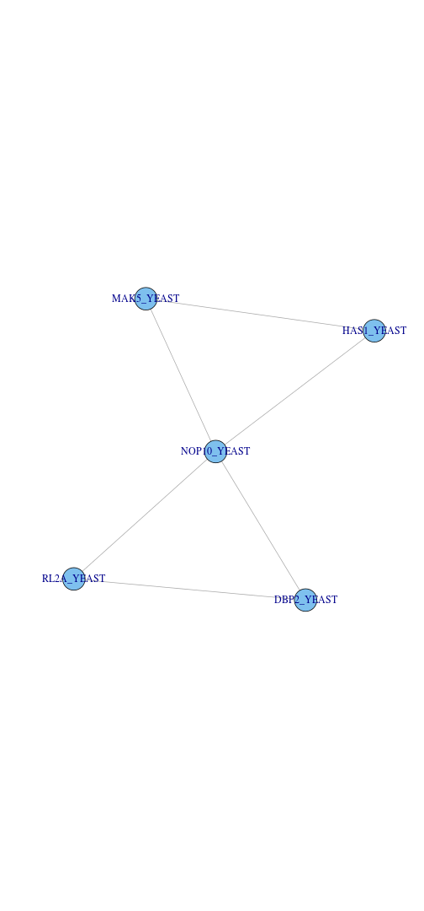 

```
## [1] "MAK5_YEAST"
```

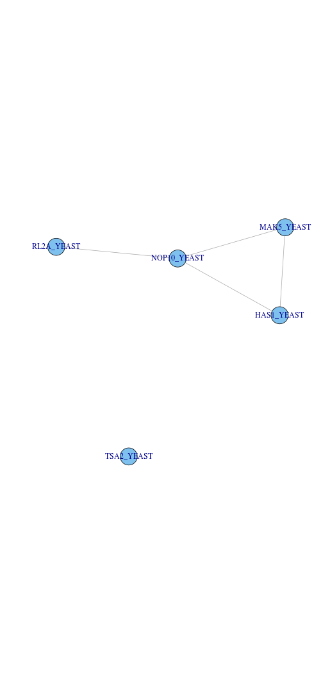 

```
## [1] "HSP7F_YEAST"
```

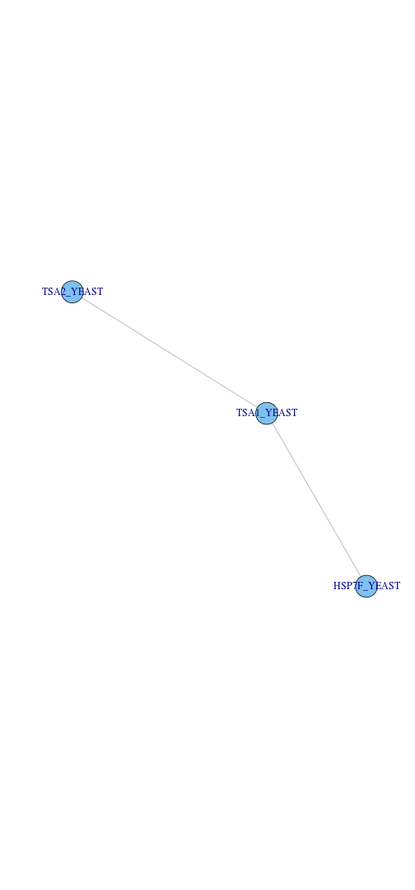 

```
## [1] "TSA2_YEAST"
```

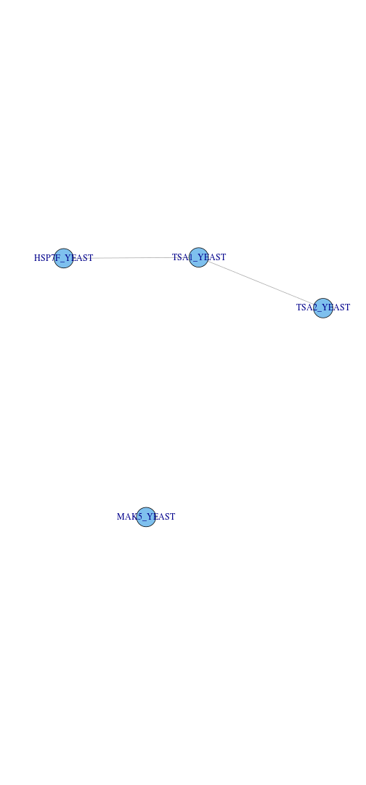 


```r
par(oma=c(3,3,4,3))
display.clusters(clust=clust2,Net=sce,main="")
cols=c("yellow","black","red","green")
 legend(x=0,y=1.25,legend=0:3,fill=cols,horiz=TRUE,bty="n",xpd=TRUE,cex=3)
```


Once we have the clusters, we can compute the local alignments using *align.local.all*. We can use a dissimilarity matrices to compute the local alignments.


```r
data(Sim)
localAligns = align.local.all(clust1=clusters1,clust2=clusters2,mat=Sim,threshold=0)
localAligns2 = align.local.all(clust1=clusters1,clust2=clusters2,mat=Sim,threshold=0,cores=1,dismat=1-Sim)
```

Finally, using the local alignments, we can compute the global alignment, using *align.global*.

```r
# scores = size.score.all(localAligns=localAligns)
# scores2 = sim.score.all(localAligns=localAligns,sim=Sim)
# scores[,2] = as.numeric(scores[,2])/5+as.numeric(scores2[,2])

alinGlobal = align.global(localAligns=localAligns,Sim=Sim)
```

```
## [1] "update.aligns"
## [1] "Hungarian"
## [1] "get.aligns"
## [1] "score"
## [1] "select"
## [1] "remove"
## [1] "solve"
## [1] "update.matrix"
## [1] "update.aligns"
## [1] "Hungarian"
## [1] "get.aligns"
## [1] "score"
## [1] "select"
## [1] "remove"
## [1] "solve"
## [1] "update.matrix"
## [1] "update.aligns"
## [1] "Hungarian"
## [1] "get.aligns"
## [1] "score"
## [1] "select"
## [1] "remove"
## [1] "solve"
## [1] "update.matrix"
## [1] "update.aligns"
## [1] "Hungarian"
## [1] "get.aligns"
## [1] "score"
## [1] "select"
## [1] "remove"
## [1] "solve"
## [1] "update.matrix"
```

```r
alinGlobal2 = align.global(localAligns=localAligns2,Sim=Sim)
```

```
## [1] "update.aligns"
## [1] "Hungarian"
## [1] "get.aligns"
## [1] "score"
## [1] "select"
## [1] "remove"
## [1] "solve"
## [1] "update.matrix"
## [1] "update.aligns"
## [1] "Hungarian"
## [1] "get.aligns"
## [1] "score"
## [1] "select"
## [1] "remove"
## [1] "solve"
## [1] "update.matrix"
## [1] "update.aligns"
## [1] "Hungarian"
## [1] "get.aligns"
## [1] "score"
## [1] "select"
## [1] "remove"
## [1] "solve"
## [1] "update.matrix"
```


To compute the edge correctness score of the global alignment, we use the function *EC.score*.

```r
for(glob in alinGlobal[[1]]){
print(EC.score(alin=glob,net1=hpy,net2=sce))
}
```

```
## [1] 1
## [1] 0.75
## [1] 0.5
## [1] 0.4285714
```

```r
for(glob in alinGlobal2[[1]]){
print(EC.score(alin=glob,net1=hpy,net2=sce))
}
```

```
## [1] 0.8
## [1] 0.6666667
## [1] 0.5714286
```

```r
EC.score(alin=alinGlobal[[2]],net1=hpy,net2=sce)
```

```
## [1] 0.4285714
```

```r
EC.score(alin=alinGlobal2[[2]],net1=hpy,net2=sce)
```

```
## [1] 0.5714286
```

To compute the functional coherence score of the global alignment, we use the function *FC.score*.


To visualize the global alignment, we can plot all the alignment with *align.plot*, or visualize only one local alignment using *align.local.plot*. The first one is useful when we have small networks, and the second one for large networks.


```r
align.plot(net1=hpy,net2=sce,global=alinGlobal2[[2]],k1=1,k2=1,edge.curved=0.5,vertex.size=5)
```

```
## [1] "plot"
## IGRAPH UNW- 15 22 -- 
## + attr: name (v/c), weight (e/n), edge.curved (e/n)
```


```r
par(oma=c(1,2,1,2))
p1 = "85962.HP0303"
p2 = "RL2A_YEAST"
align.local.plot(localAligns=localAligns,global=alinGlobal2[[2]],p1=p1,p2=p2,net1=hpy,net2=sce)
```

```
## [1] "plotting a graph with 10 vertices and 35 edges"
```


```r
par(oma=c(1,2,1,2))

p1 = "85962.HP1316"
p2 = "HAS1_YEAST"
align.local.plot(localAligns=localAligns,global=alinGlobal[[2]],p1=p1,p2=p2,net1=hpy,net2=sce)
```

```
## [1] "plotting a graph with 8 vertices and 23 edges"
```


